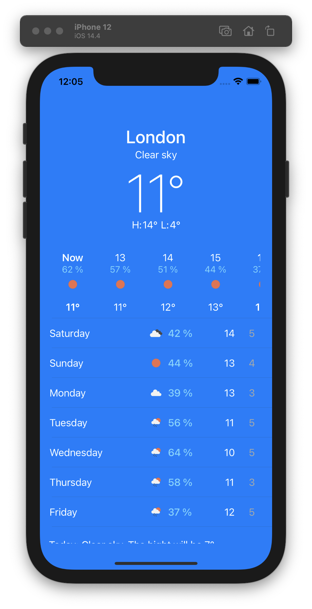

# Weather

Native Weather App Clone.

### Main Screen

[Screen recording](https://youtu.be/yklMPJ5w7to) 

## Technologies and tools
* Frameworks: UIKit, Foundation,  CoreLocation
* Using the MVC architecture
* Work with Api
* Designing an interface using Storyboard and Xib 

## Weather API
* [OpenWeather](https://openweathermap.org) - Weather API

## Contact Info
* [Linkedin](https://www.linkedin.com/in/radetsky) 

yura.radetsky@gmail.com

